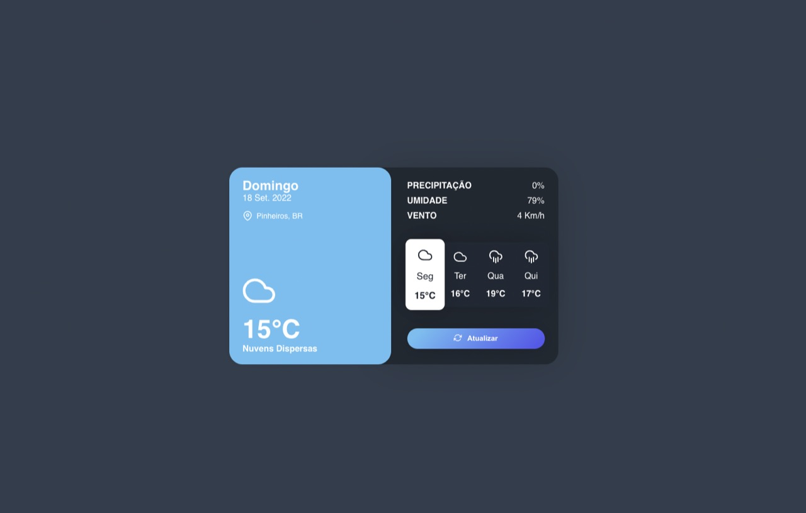
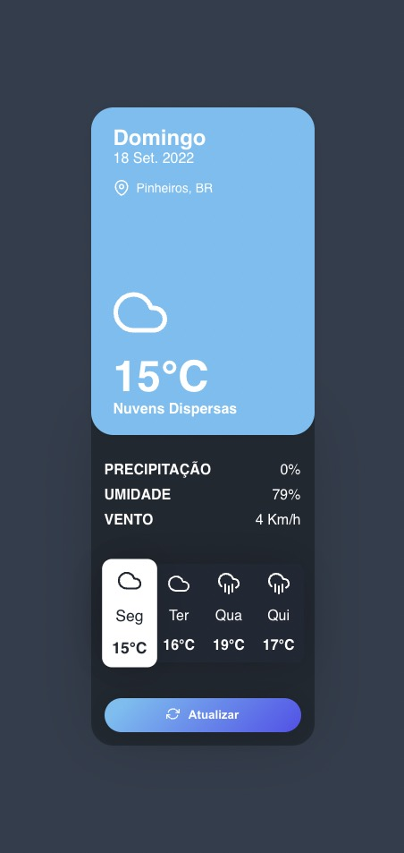
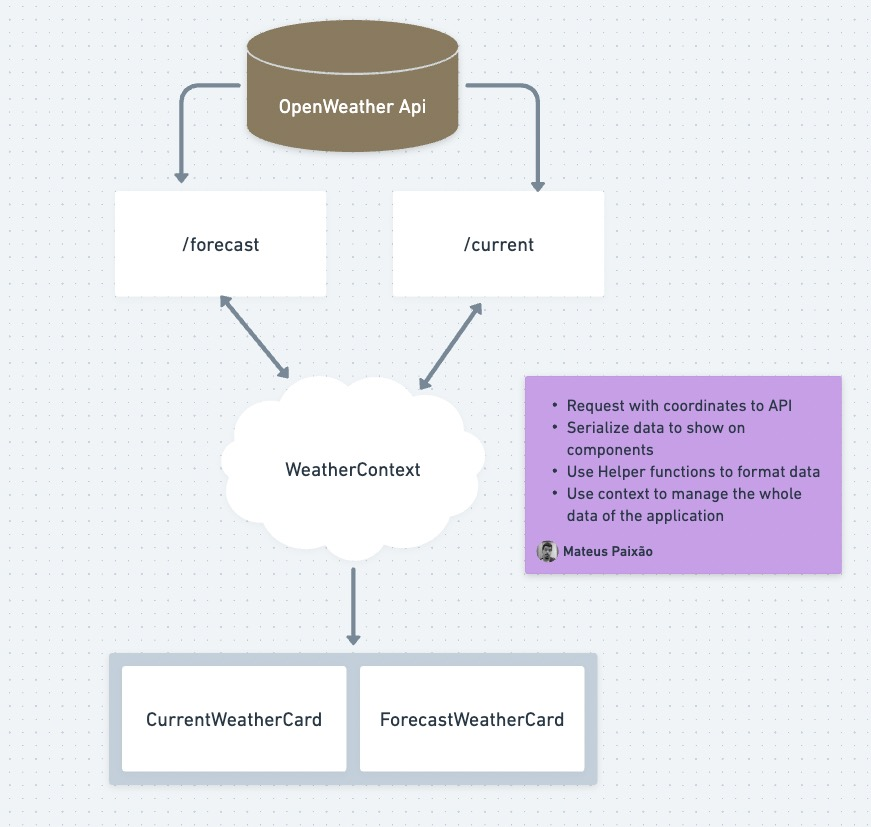

# Weather APP

  
Este projeto foi realizado como teste técnico para desenvolvedor front end para a Builders, e foi iniciado a partir do [Create React App](https://github.com/facebook/create-react-app).

  

  

## O que encontrará nesse README

  

- [Scripts disponíveis](#scritps)

- [Arquitetura do projeto](#arquitetura)

- [Links úteis](#links-uteis)

- [Agradecimento](#agradecimento)

  

## Scripts disponíveis

  

No projeto você pode rodar a partir do terminal os seguintes comandos

  

### `yarn start`

  

Para rodar a aplicação em modo de desenvolvimento (lembre-se de instalar as dependência na raiz do projeto com o comando `yarn` )

  

Abra [http://localhost:3000](http://localhost:3000) para visualizar no seu navegador, a página irá atualizar automaticamente após salvar os arquivos, e todos os erros serão apresentados em tela caso houver

### `yarn test`

Para rodar todos os testes em watch mode.

  
### `yarn test:coverage`

Para rodar todos os testes em watch mode e gerar o coverage report.

  
### `yarn build`

  

Para buildar a aplicação para modo de produção, realizando todas as minificações para uma melhor performance e gerando o bundle completo da aplicação. Após esse comando sua aplicação estará pronta para o deploy na pasta `build/` para maiores informações ver sessão [deployment](https://facebook.github.io/create-react-app/docs/deployment) na documentação oficial.

  
  

### `yarn eject`

  

Para ejetar sua aplicação do Create React App, esse comando não poderá ser desfeito.

  

## Representação simplificada do projeto

  

  

## Links uteis

  

- [Desafio Técnico](https://platformbuilders.notion.site/Desafio-8dcf7aa5988041ab8fb1b7df6102d4d0) Enunciado do desafio proposto para esse projeto.
- [TODO.md](https://github.com/MateusPaixao/TODO.md) utilizado para gerenciar os passos para finalização desse projeto e adicionado possíveis melhorias.

- [Stack Edit](https://stackedit.io/) Utilizado para editar esse Readme
- [Feather](https://feathericons.com/) Biblioteca de ícones utilizada nesse projeto
- [Open Weather API](https://openweathermap.org/) API utilizada nesse projeto

  

## Agradecimento

  

Agradeço a oportunidade de realizar o teste, espero que tenha ficado dentro do esperado, dei o melhor dentro do período que estabeleci. Obrigado! =D